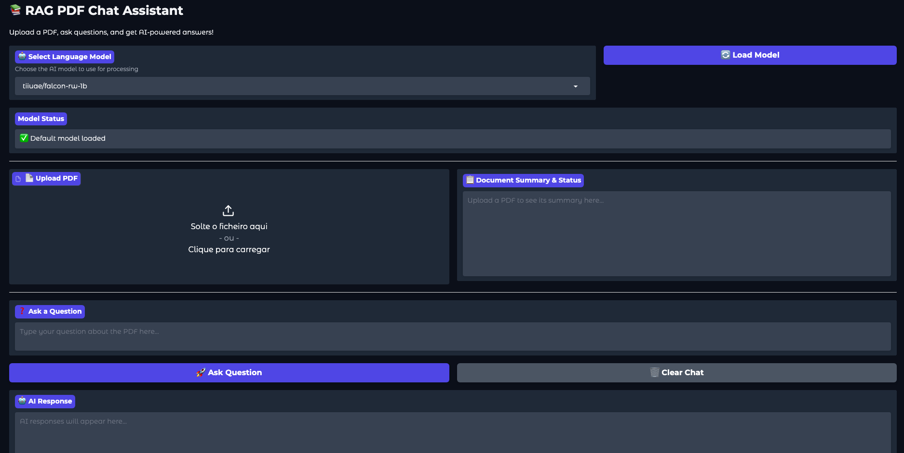

# RAG Local App 📚

A local Retrieval-Augmented Generation (RAG) application that allows you to upload PDF documents and chat with them using AI models. Built with Gradio for the interface and LangChain for RAG functionality.

## Features ✨

- **PDF Upload & Processing**: Extract text from PDF documents
- **AI-Powered Chat**: Ask questions about your uploaded documents
- **Multiple Models**: Support for Falcon and Llama models
- **Document Summarization**: Automatic summarization of uploaded PDFs
- **Conversational Memory**: Maintains chat history during sessions
- **Local Processing**: Everything runs locally on your machine

## Screenshots 📸
### Main Interface


## Requirements 🔧

- Python 3.8+
- GPU recommended for better performance (optional)
- At least 4GB RAM available

## Installation 🚀

1. **Clone the repository**
   ```bash
   git clone git@github.com:Joaoprv/rag-local-app.git
   cd rag-local-app
   ```

2. **Set up virtual environment**
   ```bash
   uv venv .venv
   source .venv/bin/activate
   ```

3. **Install dependencies**
   ```bash
   uv pip install -r pyproject.toml
   ```

## Usage 🎯

1. **Start the application**
   ```bash
   python main.py
   ```

2. **Open your browser** and go to `http://localhost:7860`

3. **Select AI Model**: Choose between available models (Falcon or Llama)

4. **Upload PDF**: Click "Upload PDF" and select your document

5. **Ask Questions**: Type questions about your document in the chat interface

## Supported Models 🤖

- **tiiuae/falcon-rw-1b**: Lightweight, fast model
- **meta-llama/llama-2-7b-chat-hf**: More capable but requires more resources

## Project Structure 📁

```
rag-local-app/
├── main.py
├── logging_config.py         
├── app/
│   ├── interface.py
│   ├── chat_rag.py
│   ├── summarizer.py
│   └── pdf_loader.py
├── prompts/
│   ├── loader.py
│   ├── summarizer_prompts.py
├── pyproject.toml
└── README.md
```

## Troubleshooting 🔍

**Common Issues:**

- **Out of Memory**: Try using the smaller Falcon model instead of Llama
- **Slow Performance**: Ensure you have sufficient RAM, consider using GPU if available
- **PDF Not Loading**: Check that your PDF contains selectable text (not just images)
